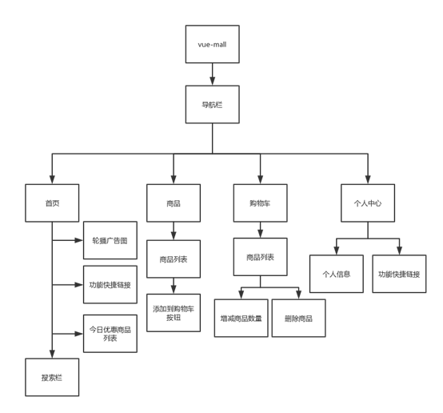

## vue-mall

### 说明

学校移动web课程设计


### Build Setup

```bash
# install dependencies
npm install

# serve with hot reload at localhost:8080
npm run dev

# build for production with minification
npm run build

# build for production and view the bundle analyzer report
npm run build --report
```


### 技术栈

Vue + sass + axios + mint-ui 


### 组件结构




### 项目目录

```bash
├─assets （静态资源，如图片，字体）
├─components
│  ├─cart-control （增加删除购物车商品组件）
│  ├─goods （商品列表组件）
│  ├─home （首页组件）
│  ├─my-space （个人中心组件）
│  ├─shop-cart （购物车组件）
│  └─today-discount （今日优惠商品组件）
├─fetch （获取服务端数据）
├─App.vue （程序入口文件）
├─main.js （webpack入口文件）
```

